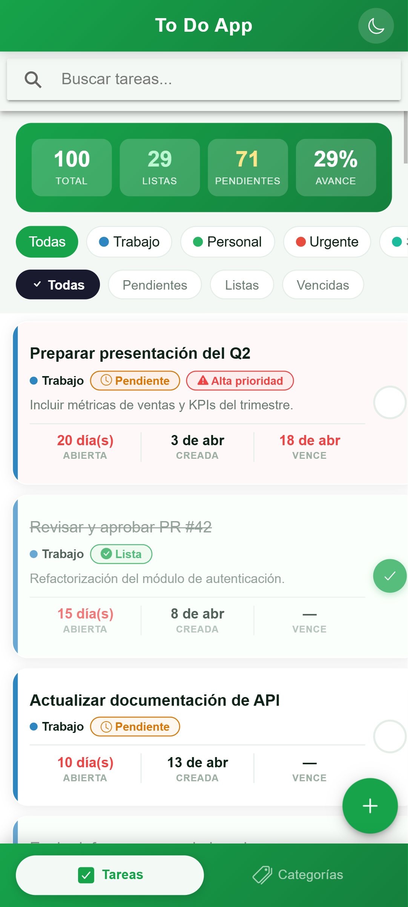
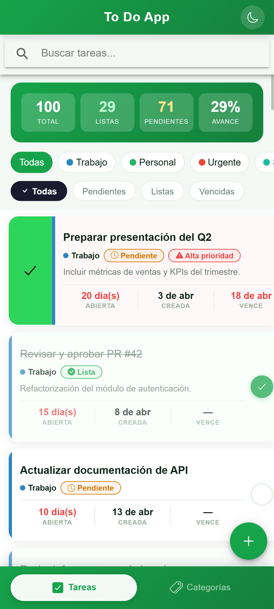
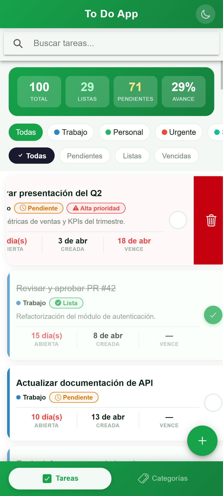
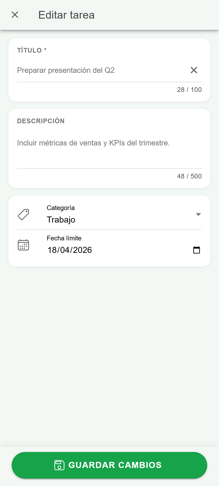
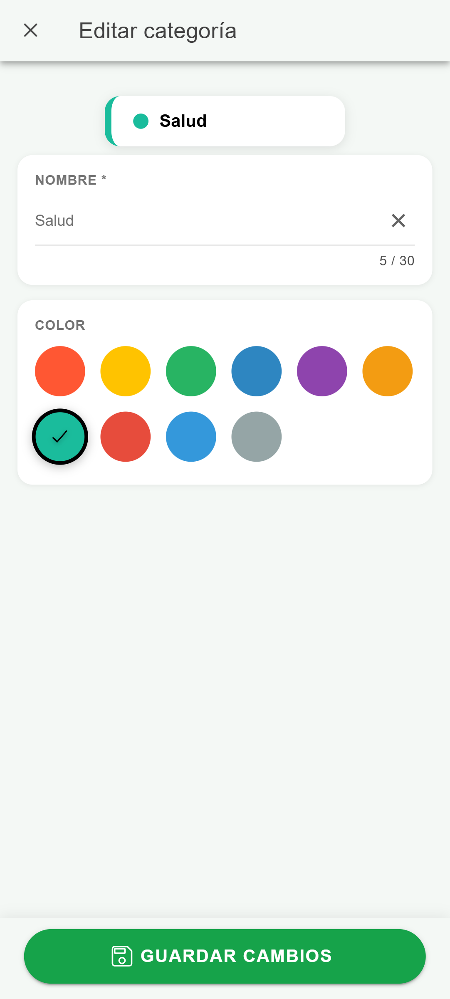
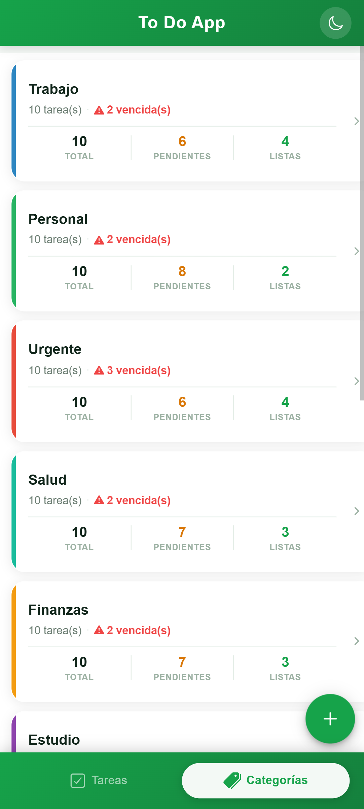
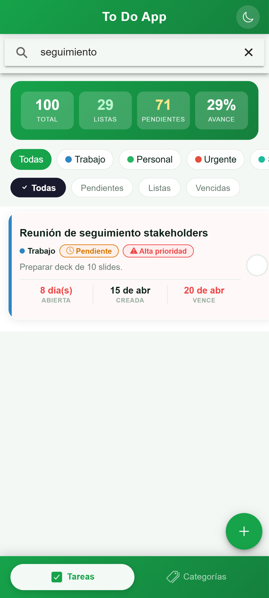

# To Do App


Aplicación móvil híbrida de gestión de tareas construida con Ionic 8 + Angular 20 + Capacitor 8 para la prueba técnica de **Accenture Colombia — Desarrollador Mobile Ionic**.

---

## ⬇️ Descargas

| Plataforma | Archivo | Tamaño |
|---|---|---|
| 🌐 **Web** (build producción) | [Todo-App-web.zip](https://github.com/YisusDm/todo-app/releases/download/v1.0.0/Todo-App-web.zip) | 1.67 MB |
| 🤖 **Android** APK | [Todo-App.apk](https://github.com/YisusDm/todo-app/releases/download/v1.0.0/Todo-App.apk) | 4.74 MB |
| 🍎 **iOS** IPA | — | Requiere macOS + Xcode — ver [instrucciones](#ios) |

> Todos los artefactos están en la página de [**Releases → v1.0.0**](https://github.com/YisusDm/todo-app/releases/tag/v1.0.0)

---

### 📲 Cómo descargar e instalar

#### Android — instalar el APK

1. Haz clic en **[Todo-App.apk](https://github.com/YisusDm/todo-app/releases/download/v1.0.0/Todo-App.apk)** — se descarga directamente desde GitHub Releases
2. Transfiere el `.apk` al dispositivo Android (USB, Drive, WhatsApp, etc.)
3. En el dispositivo: abre el archivo desde el **Gestor de archivos**
4. Si aparece el aviso *"Instalar apps de fuentes desconocidas"* → **Configuración → Seguridad → Permitir esta fuente**
5. Pulsa **Instalar** → la app aparece en el launcher como **To Do App**

```bash
# Alternativa con adb (dispositivo conectado por USB con Depuración USB activada)
adb install Todo-App.apk
```

#### 🌐 Web — desplegar el build de producción

1. Descarga **[Todo-App-web.zip](https://github.com/YisusDm/todo-app/releases/download/v1.0.0/Todo-App-web.zip)**
2. Descomprime — obtienes la carpeta `www/` con el bundle de Angular compilado
3. Sirve la carpeta con cualquier servidor estático:

```bash
# Con npx serve (sin instalación global)
npx serve www

# Con Python
python -m http.server 8080 --directory www

# O sube la carpeta directamente a Firebase Hosting, Netlify o Vercel
```

#### 🍎 iOS — generar el IPA (requiere macOS)

1. Clona el repositorio en un Mac con Xcode instalado
2. Ejecuta el build web y sync:
```bash
ionic build --prod
npx cap sync ios
npx cap open ios        # abre Xcode automáticamente
```
3. En Xcode: selecciona un dispositivo o simulador → **Product → Archive**
4. En el Organizer: **Distribute App → Ad Hoc** → exporta el `.ipa`

---

### 🏷️ Cómo se generó este release

El release `v1.0.0` se creó con los siguientes pasos:

**1. Build de producción web:**
```bash
ionic build --prod
# Output: carpeta www/ (bundle Angular + assets)
```

**2. Sync y build Android release:**
```bash
npx cap sync android
cd android && ./gradlew assembleRelease
# Output: android/app/build/outputs/apk/release/app-release.apk
```
El APK está firmado con un keystore RSA 2048-bit generado con `keytool` (JDK de Android Studio). El keystore **no se incluye en el repositorio** (`.gitignore`).

**3. Preparar artefactos:**
```bash
# Renombrar APK
cp android/app/build/outputs/apk/release/app-release.apk release-artifacts/Todo-App.apk

# Comprimir build web
Compress-Archive -Path 'www/*' -DestinationPath 'release-artifacts/Todo-App-web.zip'
```

**4. Publicar en GitHub Releases:**
Desde GitHub → pestaña **Releases** → **Draft a new release** → tag `v1.0.0` → subir los dos archivos como assets → **Publish release**.

---

## Tabla de contenido

1. [Descargas](#️-descargas)
2. [Descripción](#descripción)
3. [Stack tecnológico](#stack-tecnológico)
4. [Aspectos relevantes del stack](#aspectos-relevantes-del-stack)
   - [Capacitor en lugar de Cordova](#capacitor-en-lugar-de-cordova)
   - [SQLite via WebAssembly](#sqlite-via-webassembly-sqljs)
   - [Firebase Remote Config](#firebase-remote-config)
   - [Gestión de estado reactiva](#gestión-de-estado-reactiva-facade--rxjs)
   - [Lazy loading de tareas](#lazy-loading-de-tareas-con-paginación-reactiva)
5. [Arquitectura](#arquitectura)
6. [Decisiones arquitectónicas clave](#decisiones-arquitectónicas-clave)
7. [Esquema de datos](#esquema-de-datos)
8. [Instalación y configuración](#instalación-y-configuración)
9. [Ejecución y compilación](#ejecución-y-compilación)
10. [Estructura del proyecto](#estructura-del-proyecto)
11. [Capturas de pantalla](#-capturas-de-pantalla)
12. [Desafíos técnicos](#desafíos-técnicos)

---

## Descripción

**To Do App** es una aplicación de gestión de tareas mobile-first que permite al usuario crear, organizar, filtrar y completar tareas agrupadas por categorías con colores personalizados. Incorpora persistencia local mediante SQLite (WebAssembly), sincronización de flags de funcionalidad a través de Firebase Remote Config, modo oscuro automático, y una arquitectura orientada a la mantenibilidad y escalabilidad.

### Funcionalidades principales

| Funcionalidad | Descripción |
|---|---|
| CRUD de tareas | Crear, editar, completar y eliminar tareas con fecha límite |
| CRUD de categorías | Crear, editar y eliminar categorías con paleta de colores accesible (WCAG 2.1) |
| Filtrado combinado | Por estado (todas / pendientes / completadas / vencidas) y por categoría simultáneamente |
| Búsqueda en tiempo real | Con debounce de 300 ms sobre título y descripción |
| Carga perezosa | Lazy loading de 20 tareas por página con `ion-infinite-scroll` |
| Estadísticas | Panel con total / completadas / pendientes / % avance (controlado por Remote Config) |
| Modo oscuro | Automático via `prefers-color-scheme` + toggle manual |
| Reordenamiento | Drag & drop con `ion-reorder-group` |
| Notificaciones globales | Componente de feedback visual animado (reemplaza `ion-toast`) |

---

## Stack tecnológico

| Tecnología | Versión | Rol |
|---|---|---|
| **Angular** | 20.x | Framework SPA — componentes, módulos, DI, router |
| **Ionic Framework** | 8.x | UI components móviles nativos |
| **Capacitor** | 8.3.1 | Runtime híbrido Android / iOS |
| **Angular Fire** | 20.x | SDK oficial de Firebase para Angular |
| **Firebase Remote Config** | — | Feature flags y configuración en tiempo real |
| **sql.js** | 1.14.1 | SQLite compilado a WebAssembly — persistencia local |
| **RxJS** | 7.8.x | Programación reactiva — streams, operadores, BehaviorSubject |
| **TypeScript** | 5.9.x | Lenguaje principal — tipado estricto habilitado |
| **SCSS** | — | Estilos con variables CSS personalizadas + temas |
| **Bootstrap Icons** | 1.13.x | Iconografía complementaria |
| **Zone.js** | 0.15.x | Detección de cambios Angular |
| **Node.js** | 22.12.x | Entorno de build |

---

## Aspectos relevantes del stack

### Capacitor en lugar de Cordova

> La prueba técnica especifica *"Cordova"* como runtime nativo. Esta aplicación utiliza **Capacitor**, el reemplazo oficial de Cordova creado por el mismo equipo de Ionic. El cumplimiento del requisito es completo: la app está configurada para compilar en Android e iOS y produce APK/IPA exactamente igual que con Cordova.

#### ¿Qué es Capacitor?

Capacitor es el **runtime híbrido moderno** que permite ejecutar aplicaciones web (Ionic + Angular) como apps nativas en Android, iOS y la web. Su API de plugins expone funcionalidades del dispositivo (cámara, filesystem, notificaciones, etc.) al código JavaScript mediante puentes nativos.

#### Comparativa Cordova vs Capacitor

| Aspecto | Apache Cordova | Capacitor |
|---|---|---|
| **Creador** | Apache Software Foundation | Ionic team (mismos creadores de Ionic) |
| **Estado actual** | Mantenimiento pasivo — sin features nuevas | Desarrollo activo — releases frecuentes |
| **Arquitectura** | Plugin system propio, configuración XML (`config.xml`) | Proyecto nativo real (Xcode / Android Studio) + JS bridge |
| **Proyecto nativo** | Generado y oculto — difícil de personalizar | Totalmente visible y editable en `android/` e `ios/` |
| **Integración con Angular** | Manual — sin soporte oficial | Primera clase — `@capacitor/*` con tipado TypeScript completo |
| **Plugins** | npm + `cordova plugin add` | npm + `npx cap sync` — sin CLI separada |
| **Config** | `config.xml` (XML) | `capacitor.config.ts` (TypeScript tipado) |
| **Hot reload** | Limitado | `ionic cap run android -l` con live reload nativo |
| **Soporte iOS 17+ / Android 14+** | Problemas frecuentes | Soporte garantizado y actualizado |
| **Web platform** | No soportado | Primera clase — misma app en browser sin cambios |
| **TypeScript** | Tipos parciales / desactualizados | Tipos oficiales en todos los plugins |
| **Comunidad Ionic** | Deprecado para nuevos proyectos | Estándar recomendado desde Ionic 6 |

#### ¿Por qué Capacitor es la elección correcta hoy?

**1. Es el sucesor oficial de Cordova**
El equipo de Ionic [anunció oficialmente](https://ionic.io/blog/announcing-capacitor-1-0) que Capacitor es el reemplazo de Cordova para todos los proyectos nuevos de Ionic. Usar Cordova en 2025 sería equivalente a usar AngularJS en lugar de Angular.

**2. Proyecto nativo completo**
A diferencia de Cordova, Capacitor genera proyectos Android e iOS *reales* que viven en el repositorio. Un desarrollador Android puede abrir `android/` en Android Studio sin ninguna configuración adicional. Los equipos nativos y web pueden colaborar en el mismo repo.

**3. TypeScript nativo**
La configuración (`capacitor.config.ts`) y todos los plugins están tipados. Errores de configuración se detectan en tiempo de compilación, no en runtime.

**4. Web como plataforma de primera clase**
La misma app corre en el browser (`ionic serve`) sin adapters adicionales — facilita el desarrollo y testing sin necesidad de emulador.

#### Configuración en este proyecto

```typescript
// capacitor.config.ts
import { CapacitorConfig } from '@capacitor/cli';

const config: CapacitorConfig = {
  appId: 'com.accenture.todoapp',
  appName: 'To Do App',
  webDir: 'www',
  server: {
    androidScheme: 'https',
  },
};

export default config;
```

El build para Android e iOS sigue el flujo estándar de Capacitor (ver sección [Ejecución y compilación](#ejecución-y-compilación)).

---

### SQLite via WebAssembly (`sql.js`)

La persistencia se implementó con `sql.js`, que compila SQLite a WebAssembly. Esto permite ejecutar una base de datos relacional real en el browser y en WebView de Capacitor sin dependencias nativas. La base de datos se serializa a base64 y persiste en `localStorage` en cada escritura.

```
Browser / Capacitor WebView
        │
   sql.js (WASM)        ←— sql-wasm-browser.wasm (copiado a src/assets/)
        │
   DatabaseService      ←— run() / runBatch() / query()
        │
   SQLiteTasksRepository / SQLiteCategoriesRepository
```

### Firebase Remote Config

Dos feature flags controlan el comportamiento de la UI sin necesidad de redeploy:

| Flag | Tipo | Efecto |
|---|---|---|
| `enable_categories` | boolean | Muestra/oculta la sección de categorías, chips de filtro y ruta `/categories` |
| `show_task_stats` | boolean | Muestra/oculta el panel de estadísticas en la vista de tareas |

La inicialización es idempotente (`ensureInitialized()`) y comparte el mismo `Promise` entre el componente raíz y el route guard, evitando fetches duplicados.

#### Demostración del feature flag

**Paso 1 — Habilitar / deshabilitar el panel de estadísticas:**

1. Ir a [Firebase Console](https://console.firebase.google.com) → Tu proyecto → **Remote Config**
2. Localizar el parámetro `show_task_stats`
3. Cambiar el valor a `false` → **Publicar cambios**
4. Recargar la app: el panel de estadísticas (total / completadas / % avance) desaparece de la vista de tareas
5. Volver a `true` → **Publicar** → recargar: el panel reaparece sin redeploy

**Paso 2 — Habilitar / deshabilitar la sección de Categorías:**

1. En Remote Config localizar `enable_categories`
2. Cambiar a `false` → **Publicar cambios**
3. Recargar la app:
   - La pestaña **Categorías** desaparece del menú inferior
   - Los chips de filtro por categoría desaparecen de la vista de tareas
   - La ruta `/categories` devuelve redirect al home (guard activo)
   - Al crear/editar tareas, el selector de categoría no aparece
4. Volver a `true` → **Publicar** → recargar: todo reaparece

El flag se evalúa en `RemoteConfigService` y se expone como `Observable<boolean>`:

```typescript
// remote-config.service.ts
this.enableCategories$ = this.remoteConfigChanged$.pipe(
  map(() => getBoolean(this.rc, 'enable_categories')),
  distinctUntilChanged()
);
```

Los componentes se suscriben con `async` pipe — sin ningún condicional en el componente mismo.

### Gestión de estado reactiva (Facade + RxJS)

El estado de la aplicación se maneja a través de Facades que exponen `Observable<T>` a los componentes. Los componentes nunca mutan estado directamente — solo emiten intents.

```
Component  →  Facade.intent()  →  Repository.mutate()  →  BehaviorSubject  →  Component
```

### Lazy loading de tareas con paginación reactiva

Las tareas se cargan progresivamente con `ion-infinite-scroll`. La paginación es **client-side** sobre el stream ya filtrado:

```typescript
displayedTasksVm$ = combineLatest([filteredTasksVm$, pageSubject$])
  .pipe(map(([vms, page]) => vms.slice(0, page * PAGE_SIZE)));
```

Cuando el usuario cambia filtros, el `pageSubject` se resetea a 1 automáticamente vía un `merge()` de los tres streams de filtro.

---

## Arquitectura

La aplicación sigue una **arquitectura por capas** inspirada en Clean Architecture adaptada a Angular/Ionic:

```
┌──────────────────────────────────────────────┐
│              Presentation Layer              │
│   Components (OnPush) + Templates + SCSS     │
└─────────────────┬────────────────────────────┘
                  │  intents / observables
┌─────────────────▼────────────────────────────┐
│               State Layer                    │
│   Facades + Selectors + ViewModels           │
└─────────────────┬────────────────────────────┘
                  │  CRUD calls
┌─────────────────▼────────────────────────────┐
│                Data Layer                    │
│   Repository interfaces + SQLite impl.       │
└─────────────────┬────────────────────────────┘
                  │
┌─────────────────▼────────────────────────────┐
│             Infrastructure Layer             │
│   DatabaseService + RemoteConfigService      │
└──────────────────────────────────────────────┘
```

### Módulos Angular

```
AppModule (raíz)
├── CoreModule           ← providers singleton: repos, DB, Remote Config
├── AppRoutingModule     ← lazy load feature modules
├── TasksModule          ← feature: tareas
└── CategoriesModule     ← feature: categorías (guarda por Remote Config)
```

---

## Decisiones arquitectónicas clave

### 1. Repository Pattern con `InjectionToken`

Las interfaces de repositorio se desacoplan de la implementación mediante tokens de inyección de Angular:

```typescript
export const TASKS_REPOSITORY = new InjectionToken<ITasksRepository>('ITasksRepository');

// CoreModule providers:
{ provide: TASKS_REPOSITORY, useClass: SqliteTasksRepository }
```

Cambiar el motor de persistencia (SQLite → Firestore → IndexedDB) requiere **cero cambios en Facades o componentes** — solo cambiar `useClass` en CoreModule.

### 2. ViewModel como contrato de presentación

`TaskViewModel` pre-computa en el selector todas las propiedades derivadas que el template necesita, eliminando llamadas a funciones en la vista (anti-patrón que fuerza re-evaluaciones en cada ciclo de detección):

```typescript
export interface TaskViewModel {
  task: Task;
  categoryName: string;
  categoryColor: string;
  isOverdue: boolean;
  isUpcomingDue: boolean;
  daysOpen: number;
  formattedDueDate: string;
  formattedCreatedAt: string;
}
```

### 3. SQLite sobre `@ionic/storage`

Se eligió `sql.js` (SQLite real) sobre `@ionic/storage` (clave-valor) para:
- Soporte a queries complejas con `JOIN`, `WHERE`, `ORDER BY`, `LIMIT/OFFSET`
- Índices para consultas eficientes sobre 1 000+ tareas
- Transacciones atómicas via `runBatch()` (p.ej. reorder de tareas)

### 4. Contraste accesible en categorías (WCAG 2.1)

El color del ícono de selección en la paleta de categorías se calcula en runtime con la fórmula de luminancia relativa WCAG 2.1 para garantizar contraste mínimo 3:1:

```typescript
private wcagCheckColor(hex: string): string {
  // Luminancia relativa → L > 0.3 usa negro, resto blanco
  const L = 0.2126 * r + 0.7152 * g + 0.0722 * b;
  return L > 0.3 ? '#000000' : '#ffffff';
}
```

### 5. Versión automática desde `package.json`

La versión visible en el splash screen se inyecta en build time desde `package.json` vía un `InjectionToken` con factory:

```typescript
export const APP_VERSION = new InjectionToken<string>('AppVersion', {
  providedIn: 'root',
  factory: () => packageJson.version,
});
```

`npm version patch/minor/major` es el único comando necesario para actualizar la versión en toda la app.

---

## Esquema de datos

### Tabla `tasks`

| Campo | Tipo SQLite | Descripción |
|---|---|---|
| `id` | `TEXT PRIMARY KEY` | UUID v4 generado en cliente |
| `title` | `TEXT NOT NULL` | Título de la tarea |
| `description` | `TEXT` | Descripción opcional |
| `completed` | `INTEGER NOT NULL DEFAULT 0` | 0 = pendiente, 1 = completada |
| `categoryId` | `TEXT` | FK → `categories.id` (nullable) |
| `dueDate` | `TEXT` | Fecha límite en formato ISO 8601 |
| `sortOrder` | `INTEGER NOT NULL DEFAULT 0` | Posición para reordenamiento drag & drop |
| `createdAt` | `TEXT NOT NULL` | Timestamp ISO 8601 |
| `updatedAt` | `TEXT NOT NULL` | Timestamp ISO 8601 |

### Tabla `categories`

| Campo | Tipo SQLite | Descripción |
|---|---|---|
| `id` | `TEXT PRIMARY KEY` | UUID v4 generado en cliente |
| `name` | `TEXT NOT NULL` | Nombre de la categoría |
| `color` | `TEXT NOT NULL` | Color hex (ej. `#2E86C1`) |
| `createdAt` | `TEXT NOT NULL` | Timestamp ISO 8601 |

### Índices

```sql
CREATE INDEX idx_tasks_completed  ON tasks(completed);
CREATE INDEX idx_tasks_categoryId ON tasks(categoryId);
CREATE INDEX idx_tasks_sortOrder  ON tasks(sortOrder);
CREATE INDEX idx_tasks_dueDate    ON tasks(dueDate);
```

---

## Instalación y configuración

### Prerrequisitos

| Herramienta | Versión mínima |
|---|---|
| Node.js | 18.x o superior |
| npm | 9.x o superior |
| Angular CLI | 20.x |
| Ionic CLI | 7.x |

### 1. Clonar el repositorio

```bash
git clone <url-del-repositorio>
cd todo-app
```

### 2. Instalar dependencias

```bash
npm install
```

### 3. Configurar Firebase

Crea un proyecto en [Firebase Console](https://console.firebase.google.com) y configura Remote Config con los siguientes parámetros:

| Parámetro | Tipo | Valor por defecto recomendado |
|---|---|---|
| `enable_categories` | Boolean | `true` |
| `show_task_stats` | Boolean | `true` |

Edita `src/environments/environment.ts` con tus credenciales de Firebase:

```typescript
export const environment = {
  production: false,
  firebase: {
    apiKey: 'TU_API_KEY',
    authDomain: 'TU_PROYECTO.firebaseapp.com',
    projectId: 'TU_PROYECTO',
    storageBucket: 'TU_PROYECTO.appspot.com',
    messagingSenderId: 'TU_SENDER_ID',
    appId: 'TU_APP_ID',
  },
};
```

> ⚠️ `environment.prod.ts` está en `.gitignore`. Nunca subas claves de producción al repositorio.

---

## Ejecución y compilación

### Desarrollo (browser)

```bash
ionic serve
# o
ng serve
```

La app queda disponible en `http://localhost:8100`.

### Build de producción (web)

```bash
ionic build --prod
# o
ng build --configuration production
```

El output se genera en `www/`.

### Android

```bash
# 1. Agregar plataforma (solo la primera vez)
npx cap add android

# 2. Build web
ionic build --prod

# 3. Sincronizar assets al proyecto nativo
npx cap sync android

# 4. Abrir en Android Studio
npx cap open android
```

En Android Studio: **Build → Build Bundle(s) / APK(s) → Build APK(s)**

El APK debug se genera en:
```
android/app/build/outputs/apk/debug/app-debug.apk
```

### iOS

> Requiere macOS con Xcode instalado.

```bash
# 1. Agregar plataforma (solo la primera vez)
npx cap add ios

# 2. Build web
ionic build --prod

# 3. Sincronizar assets al proyecto nativo
npx cap sync ios

# 4. Abrir en Xcode
npx cap open ios
```

En Xcode: selecciona simulador o dispositivo → **Product → Archive**.

### Gestión de versiones

```bash
npm version patch   # 1.0.0 → 1.0.1
npm version minor   # 1.0.0 → 1.1.0
npm version major   # 1.0.0 → 2.0.0
```

La versión se refleja automáticamente en el splash screen sin cambios adicionales.

---

## Estructura del proyecto

```
todo-app/
├── src/
│   ├── app/
│   │   ├── app.component.ts          # Raíz: init repos, splash timing, nav
│   │   ├── app.module.ts             # Módulo raíz + providers globales
│   │   ├── app-routing.module.ts     # Rutas lazy + route guards
│   │   │
│   │   ├── core/                     # Singleton: servicios, repos, DB
│   │   │   ├── core.module.ts
│   │   │   ├── database/
│   │   │   │   └── database.service.ts      # SQLite (sql.js WASM)
│   │   │   ├── guards/
│   │   │   │   └── categories-feature.guard.ts
│   │   │   ├── repositories/
│   │   │   │   ├── tasks.repository.ts              # ITasksRepository interface
│   │   │   │   ├── sqlite-tasks.repository.ts       # Implementación SQLite
│   │   │   │   ├── storage-tasks.repository.ts      # Implementación fallback
│   │   │   │   ├── categories.repository.ts
│   │   │   │   ├── sqlite-categories.repository.ts
│   │   │   │   └── storage-categories.repository.ts
│   │   │   ├── services/
│   │   │   │   ├── remote-config.service.ts  # Firebase Remote Config
│   │   │   │   ├── mock-data.service.ts      # Seeder: 10 categorías + 100 tareas
│   │   │   │   ├── theme.service.ts          # Dark mode toggle
│   │   │   │   ├── task.service.ts
│   │   │   │   └── category.service.ts
│   │   │   └── tokens/
│   │   │       └── app-version.token.ts      # InjectionToken → package.json
│   │   │
│   │   ├── features/
│   │   │   ├── tasks/
│   │   │   │   ├── task-page/                # Vista principal de tareas
│   │   │   │   ├── task-form/                # Modal crear/editar tarea
│   │   │   │   └── state/
│   │   │   │       ├── tasks.facade.ts       # Estado + paginación reactiva
│   │   │   │       └── tasks.selectors.ts    # TaskViewModel builder
│   │   │   └── categories/
│   │   │       ├── category-page/            # Lista de categorías
│   │   │       ├── category-form/            # Modal crear/editar categoría
│   │   │       └── state/
│   │   │           └── categories.facade.ts
│   │   │
│   │   └── shared/
│   │       ├── components/
│   │       │   ├── notification/             # Toast global animado
│   │       │   └── splash-screen/            # Animación de entrada + v1.0.0
│   │       ├── models/
│   │       │   ├── task.model.ts             # Task interface + TaskFilter enum
│   │       │   └── category.model.ts
│   │       └── services/
│   │           └── notification.service.ts
│   │
│   ├── assets/
│   │   └── sql-wasm-browser.wasm     # SQLite compilado a WebAssembly
│   ├── environments/
│   │   ├── environment.ts            # Dev — Firebase config
│   │   └── environment.prod.ts       # Prod — gitignored
│   ├── global.scss                   # Imports Ionic + Bootstrap Icons
│   └── theme/
│       └── variables.scss            # CSS custom properties (colores, radios, sombras)
│
├── capacitor.config.ts
├── angular.json
├── tsconfig.json
└── package.json
```

---

## 📸 Capturas de pantalla

> Capturas tomadas en emulador Chrome DevTools — Pixel 7 (412 × 915 dp)

### Vista de tareas

<table>
  <tr>
    <td align="center"><strong>Lista de tareas</strong><br/><sub>Stats · Categorías · Filtros</sub></td>
    <td align="center"><strong>Swipe — Completar</strong><br/><sub>Deslizar derecha</sub></td>
    <td align="center"><strong>Swipe — Eliminar</strong><br/><sub>Deslizar izquierda</sub></td>
  </tr>
  <tr>
    <td></td>
    <td></td>
    <td></td>
  </tr>
</table>

### Formularios

<table>
  <tr>
    <td align="center"><strong>Editar tarea</strong><br/><sub>Título · Descripción · Categoría · Fecha</sub></td>
    <td align="center"><strong>Editar categoría</strong><br/><sub>Nombre · Paleta de colores WCAG</sub></td>
  </tr>
  <tr>
    <td></td>
    <td></td>
  </tr>
</table>

### Categorías & Búsqueda

<table>
  <tr>
    <td align="center"><strong>Categorías</strong><br/><sub>Contador de tareas · Vencidas</sub></td>
    <td align="center"><strong>Búsqueda en tiempo real</strong><br/><sub>debounce 300ms · Filtro live</sub></td>
  </tr>
  <tr>
    <td></td>
    <td></td>
  </tr>
</table>

---


## Desafíos técnicos

### ¿Cuáles fueron los principales desafíos?

**1. Integración de SQLite via WebAssembly en browser**
`sql.js` carga un archivo `.wasm` en tiempo de ejecución. El servidor de desarrollo de Angular no servía el asset correctamente desde `node_modules`. La solución fue copiar `sql-wasm-browser.wasm` a `src/assets/` y usar una URL absoluta en `locateFile`:
```typescript
locateFile: () => '/assets/sql-wasm-browser.wasm'
```

**2. Paginación reactiva coherente con filtros**
El mayor reto fue resetear la página a 1 cuando cualquier filtro cambia, sin emitir estado inconsistente. La solución fue un `merge()` de los tres streams de filtro que dispara `pageSubject.next(1)` antes de que `filteredTasksVm$` emita el nuevo resultado.

**3. Compatibilidad de esModuleInterop con sql.js**
`sql.js` usa `export =` (sintaxis CommonJS). El import `import initSqlJs from 'sql.js'` requería `esModuleInterop: true` y `allowSyntheticDefaultImports: true` en tsconfig.

### ¿Qué técnicas de optimización de rendimiento aplicaste?

| Técnica | Implementación |
|---|---|
| `ChangeDetectionStrategy.OnPush` | Todos los componentes de página y formularios |
| `trackBy` | Todos los `@for` — evita re-renders innecesarios |
| `async` pipe | Sin suscripciones manuales en templates |
| `takeUntil` + `destroy$` | Desuscripción automática al destruir componentes |
| `debounceTime(300)` | Búsqueda en tiempo real sin disparar en cada keystroke |
| `distinctUntilChanged` | Evita emisiones duplicadas en filtros |
| `TaskViewModel` pre-computado | Cero llamadas a funciones en templates |
| Lazy loading de módulos | `loadChildren` — carga bajo demanda |
| Lazy loading de lista | `ion-infinite-scroll` — 20 items iniciales |
| Índices SQLite | 4 índices en `tasks` para queries de filtro/orden eficientes |

### ¿Cómo aseguraste la calidad y mantenibilidad del código?

- **TypeScript strict** — `strict: true`, `strictTemplates: true`, sin uso de `any`
- **Repository Pattern** — intercambio de motor de persistencia sin tocar UI
- **Facade Pattern** — lógica de negocio centralizada, componentes solo exponen intents
- **InjectionToken** — desacoplamiento entre interfaces y sus implementaciones
- **Angular new control flow** — `@if` / `@for` en lugar de directivas deprecadas
- **WCAG 2.1** — contraste accesible calculado algorítmicamente en paleta de colores
